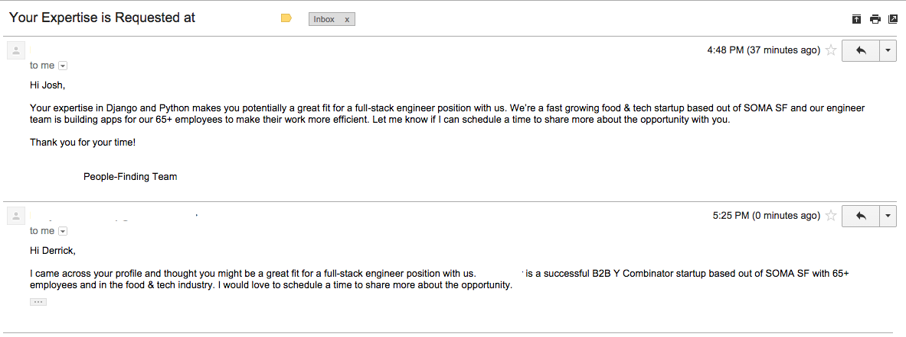

---

title: "WTF Recruiters - Take 2"
date: "2014-12-19"
tags:
 - "wtf"
 - "emails"
 - "recruiters"
path: "/blog/wtf-recruiters-take-2"
expires: false

---

Maybe this will become a standard series for me, but after my first [WTF Recruiters](/blog/wtf-recruiters/) post, I thought I'd be on the do-not-call list for recruiters... Guess not! Although this time I was not subjected to someone telling me of his animal sacrafices to contact me, the below email was amusing none-the-less. And all I have to say is that I guess I should be flattered that my email was slightly more appealing than Derrick's.

