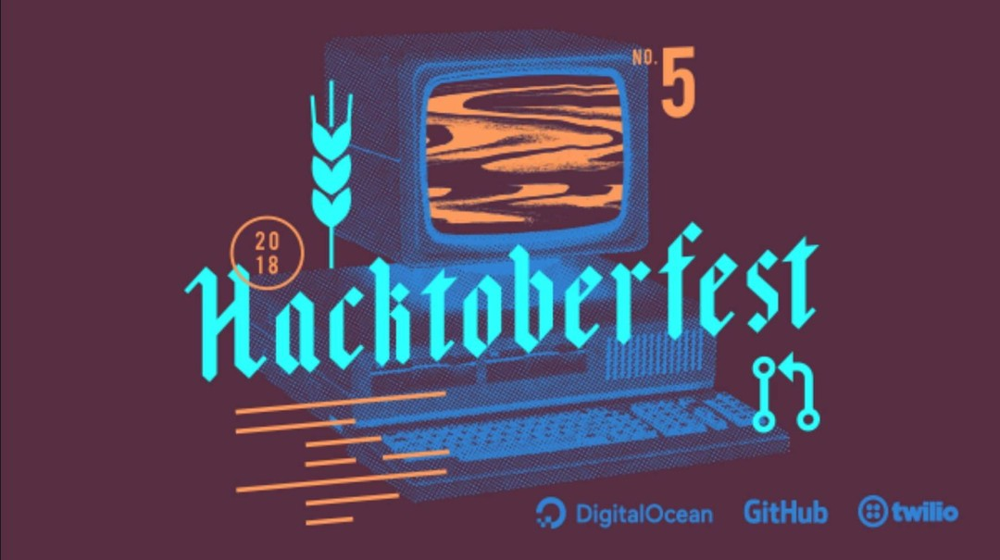

---

title: "Hacktoberfest is AWESOME!"
date: "2018-10-01"
tags:
  - "open-source"
  - "hacktoberfest"
path: "/blog/hacktoberfest-is-awesome"
expires: false

---

Photo by DigitalOcean.

It's that time of year again. [Hacktoberfest](https://hacktoberfest.digitalocean.com/) has been announced, and I am THRILLED to do it again this year. For anyone who is not familiar with Hacktoberfest, it is a month long challenge to open 5 pull requests to any public repo on Github. The idea is to get more people active in the open-source community. And after trying it last year, I can say it's pretty cool.

You can get the gist of what Hacktoberfest is about on their website, but I just wanted to give some exposure here. See the rules below:

> To get a shirt, you must make five pull requests (PRs) between October 1–31 in any timezone. PRs can be to any public repo on GitHub, not just the ones highlighted. The PR must contain commits you made yourself. PRs reported by maintainers as spam or that are automated will be marked as invalid and won't count towards the shirt.

Last year I was able to complete 5 pull-requests to open-source projects, unfortunately 2 of them were to my own open-source projects and this year I really want to make an effort to contribute to 5 unique open-source projects I do not control. Check back here for my progress!

# Open Source Pull Requests

* [Pushfile (Own Project)](https://github.com/joshfinnie/pushfile/pull/14)
* [screenshot.jfin.us (Own Project)](https://github.com/joshfinnie/screenshot.jfin.us/pull/2)
* [This Website](https://github.com/joshfinnie/joshfinnie.com/pull/16)
* [bodybuilder](https://github.com/danpaz/bodybuilder/pull/207)
* [DCJS Playday](https://github.com/dcjs/playdays/pull/5)
